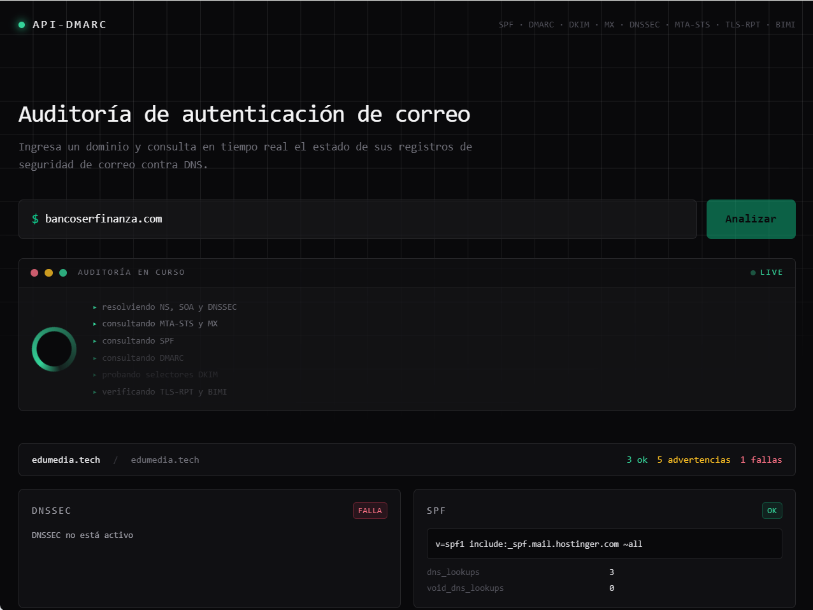

# API DMARC

API REST en Python + Flask (con un frontend incluido) para validar la configuración de autenticación de correo electrónico de un dominio: SPF, DMARC, DKIM, MX, DNSSEC, MTA-STS, TLS-RPT y BIMI. Usa [checkdmarc](https://github.com/domainaware/checkdmarc) para la mayoría de los protocolos y [dkimpy](https://pypi.org/project/dkimpy/) para DKIM. El frontend usa [htmx](https://htmx.org/) en vez de JavaScript propio: el servidor renderiza y devuelve fragmentos HTML.

Este proyecto está en una etapa inicial. El objetivo completo, la arquitectura planeada y los endpoints futuros están descritos en [AGENTS.md](AGENTS.md).

Demo


## Requisitos

* Python 3.11+

## Instalación

```bash
python -m venv env
env\Scripts\activate      # Windows
pip install -r requirements.txt
```

## Uso

```bash
python app.py
```

El servidor escucha en `0.0.0.0` y toma el puerto de la variable de entorno `PORT` (por defecto `5000` si no está definida) — esto es lo que espera Railway y la mayoría de PaaS para poder enrutar tráfico al contenedor. El modo debug está apagado por defecto (expone el debugger de Werkzeug, un riesgo si queda accesible); para activarlo en desarrollo local, definir `FLASK_DEBUG=true`.

## Endpoints disponibles

### `GET /`

Sirve el frontend: un formulario para ingresar un dominio y ver el resultado del análisis. Si se abre con `?domain=example.com`, renderiza el resultado directamente (útil para compartir el enlace).

### `POST /check`

Endpoint HTML consumido por htmx (`hx-post` del formulario del frontend), recibe `domain` (y opcionalmente `selector`) como campos de formulario. Devuelve un fragmento HTML renderizado con el resultado, no JSON.

### `GET /api/check/<domain>`

Ejecuta `checkdmarc.check_domains()` sobre el dominio indicado, agrega el chequeo de DKIM y devuelve todo en JSON.

```bash
curl http://127.0.0.1:5000/api/check/example.com
```

DKIM no tiene una ubicación fija en DNS (depende de un selector), así que se prueba una lista de selectores comunes (`default`, `selector1`, `selector2`, `google`, `k1`, `k2`, `s1`, `s2`, `dkim`, `mail`). Para probar un selector adicional propio del dominio:

```bash
curl "http://127.0.0.1:5000/api/check/example.com?selector=mi-selector"
```

## Roadmap

Los endpoints adicionales por protocolo (`/api/spf`, `/api/dmarc`, `/api/dkim`, `/api/bimi`, `/api/mta-sts`, `/api/tls-rpt`, `/api/mx`, `/api/dnssec`, `/api/starttls`, validación en bulk, etc.) y la arquitectura por capas (routes/services/models/utils) todavía no están implementados. Ver [AGENTS.md](AGENTS.md) para el detalle completo.
