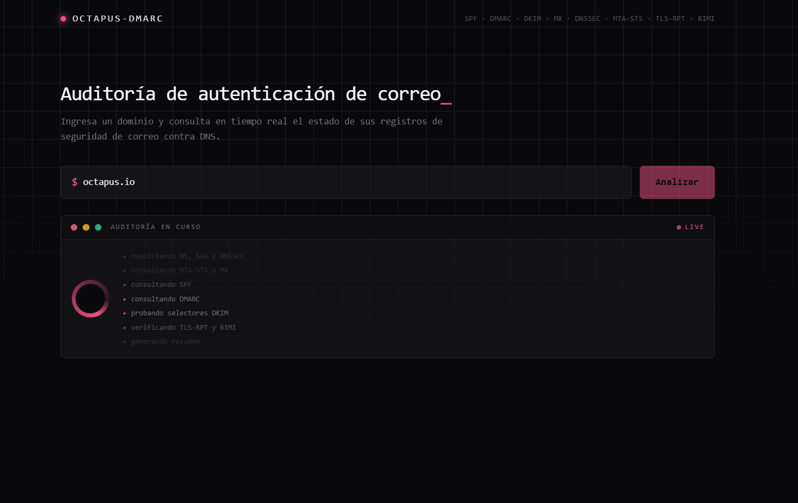
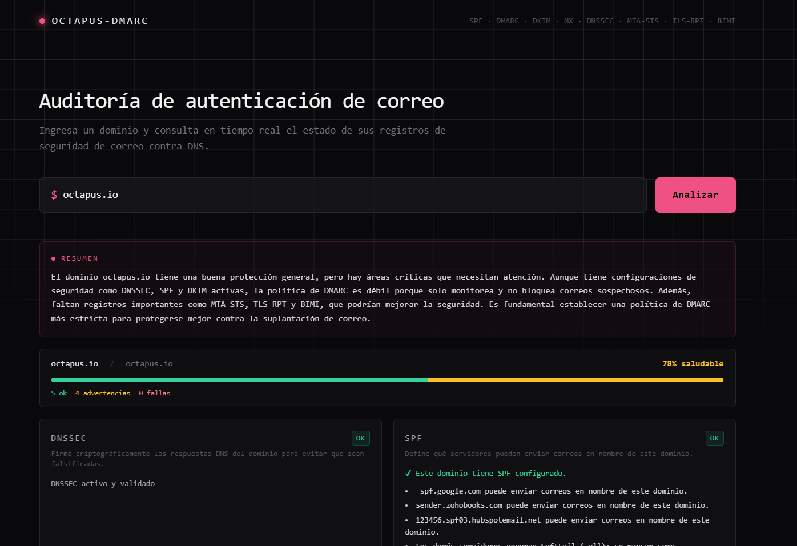

# API DMARC

API REST en Python + Flask (con un frontend incluido) para validar la configuración de autenticación de correo electrónico de un dominio: SPF, DMARC, DKIM, MX, DNSSEC, MTA-STS, TLS-RPT y BIMI. Usa [checkdmarc](https://github.com/domainaware/checkdmarc) para la mayoría de los protocolos y [dkimpy](https://pypi.org/project/dkimpy/) para DKIM. El frontend usa [htmx](https://htmx.org/) en vez de JavaScript propio: el servidor renderiza y devuelve fragmentos HTML.

Este proyecto está en una etapa inicial. El objetivo completo, la arquitectura planeada y los endpoints futuros están descritos en [AGENTS.md](AGENTS.md).

# Qué hace la app hoy

**1. Checker puntual** (`/`, `/check`, `/api/check/<domain>`): audita cualquier dominio contra SPF, DMARC, DKIM, MX, DNSSEC, MTA-STS, TLS-RPT, BIMI y NS. Muestra un resumen con IA, cards de "riesgos y qué hacer" con severidad y acción concreta, y no guarda nada — es 100% bajo demanda.

**2. Monitoreo continuo** (`/monitoreo/...`): permite registrar un dominio, genera las instrucciones exactas de DNS para DMARC/TLS-RPT/SPF (con detección de proveedor por MX y generador de política interactivo), verifica en vivo si ya se publicó el cambio, y deja un dashboard con historial de reportes y alertas — persistido en Postgres.

Demo

<p align="center">
  
  
</p>

## Requisitos

* Python 3.11+

## Instalación

```bash
python -m venv env
env\Scripts\activate      # Windows
pip install -r requirements.txt
```

## Uso

```bash
python app.py
```

El servidor escucha en `0.0.0.0` y toma el puerto de la variable de entorno `PORT` (por defecto `5000` si no está definida) — esto es lo que espera Railway y la mayoría de PaaS para poder enrutar tráfico al contenedor. El modo debug está apagado por defecto (expone el debugger de Werkzeug, un riesgo si queda accesible); para activarlo en desarrollo local, definir `FLASK_DEBUG=true`.

### Resumen con IA (opcional)

Si defines `OPENAI_PROJECT_API_KEY` en `.env` (ver `.env-example`), después de cada búsqueda se muestra un resumen de máximo 6 líneas generado con OpenAI sobre la salud de autenticación del dominio. Es completamente opcional: sin esa variable, la app funciona igual, sólo no aparece esa sección.

## Endpoints disponibles

### `GET /`

Sirve el frontend: un formulario para ingresar un dominio y ver el resultado del análisis. Si se abre con `?domain=example.com`, renderiza el resultado directamente (útil para compartir el enlace).

### `POST /check`

Endpoint HTML consumido por htmx (`hx-post` del formulario del frontend), recibe `domain` (y opcionalmente `selector`) como campos de formulario. Devuelve un fragmento HTML renderizado con el resultado, no JSON.

### `GET/POST /registro`, `GET/POST /ingresar`, `POST /salir`

Crear cuenta, iniciar sesión y cerrar sesión (`Flask-Login`). Necesarios para usar el checker (`/`, `/check`) y el monitoreo (`/monitoreo`, `/monitoreo/lista`) — la API JSON (`/api/check/<domain>`) y las rutas por `access_token` del dashboard quedan públicas a propósito, ver `AGENTS.md`.

### `GET /api/check/<domain>`

Ejecuta `checkdmarc.check_domains()` sobre el dominio indicado, agrega el chequeo de DKIM y devuelve todo en JSON.

```bash
curl http://127.0.0.1:5000/api/check/example.com
```

DKIM no tiene una ubicación fija en DNS (depende de un selector), así que se prueba una lista de selectores comunes (`default`, `selector1`, `selector2`, `google`, `k1`, `k2`, `s1`, `s2`, `dkim`, `mail`). Para probar un selector adicional propio del dominio:

```bash
curl "http://127.0.0.1:5000/api/check/example.com?selector=mi-selector"
```

### `GET/POST /monitoreo` (requiere sesión)

Alta de un dominio para **monitoreo continuo**: registra el dominio en Postgres (`DATABASE_URL`, obligatoria) bajo la cuenta logueada, y muestra el DNS exacto que hay que agregar (`rua=` apuntando a `DMARC_REPORTS_MAILBOX`) para empezar a recibir reportes DMARC reales. Devuelve un link (`/monitoreo/<token>`) con el dashboard de ese dominio.

### `GET /monitoreo/lista` (requiere sesión)

Lista de los dominios registrados para monitoreo por la cuenta logueada, con link a cada dashboard. Ver `/registro` e `/ingresar` para crear cuenta e iniciar sesión.

### `POST /webhooks/dmarc-aggregate/<secret>`

Recibe el JSON de un reporte DMARC agregado ya parseado por [parsedmarc](https://github.com/domainaware/parsedmarc) (configurado como servicio aparte, ver `config/parsedmarc.ini.example`). `<secret>` debe coincidir con `DMARC_WEBHOOK_SECRET`; si no, responde 404. Guarda el reporte y compara los remitentes reales contra el SPF declarado del dominio, generando una alerta por cada IP no reconocida.

### `config/parsedmarc.ini`

No es parte del deploy de esta app — es la configuración del **worker de parsedmarc**, un proceso aparte (Fase 4 del plan, ver `AGENTS.md`) que corre en otro lugar (tu máquina para probar, o un servicio dedicado en Railway) y hace tres cosas: se conecta por IMAP a una casilla dedicada a recibir reportes DMARC, parsea los reportes agregados que encuentra, y le hace `POST` a `/webhooks/dmarc-aggregate/<secret>` de esta app.

El archivo real (`config/parsedmarc.ini`, no el `.example`) está en `.gitignore` a propósito — nunca se sube al repo porque tiene la contraseña de la casilla en texto plano. Para producción, en vez de subir el archivo, se configuran las mismas claves como variables de entorno con prefijo `PARSEDMARC_<SECCIÓN>_<CLAVE>` (ver `.env-example`) — parsedmarc las lee directo, sin necesitar el `.ini`.

**Importante**: la casilla configurada ahí debe ser una **dedicada sólo a recibir reportes DMARC**, nunca una casilla de uso normal — parsedmarc mueve automáticamente cualquier correo que no sea un reporte válido a una carpeta de archivo (`archive_folder`), así que apuntarlo a un correo de trabajo real termina archivando esos correos sin querer.

**Estado actual (recordatorio)**: ya existe un servicio `parsedmarc-worker` desplegado en Railway, en el mismo proyecto que la app web (`akila-dmarc`). Corre `parsedmarc` de forma continua, escucha por IMAP la casilla configurada en sus variables `PARSEDMARC_IMAP_*`, y manda cada reporte agregado que encuentra a `https://akila-dmarc-production.up.railway.app/webhooks/dmarc-aggregate/<DMARC_WEBHOOK_SECRET>` (el secreto real está sólo en las variables de Railway de ambos servicios, no acá).

Notas rápidas para no confundir estas variables entre sí:

* `DMARC_REPORTS_MAILBOX` y `DMARC_WEBHOOK_SECRET` (de la app web) sólo le dicen a esta app a qué casilla apuntar el `rua=` y qué secreto exigir en el webhook — no son credenciales de acceso a la casilla.
* Las credenciales IMAP de la casilla (host/usuario/password) van en las `PARSEDMARC_IMAP_*` del worker, nunca en `.env` de la app web.
* `SMTP_*` es para mandar los correos de alerta (`services/notifications.py`) — no tiene relación con recibir reportes.

### `python jobs/recheck_domains.py`

No es una ruta HTTP — es el job de vigilancia DNS periódica, pensado para correr como cron (ej. cada 6-12h). Reutiliza `run_check()` para cada dominio registrado, compara contra el último chequeo guardado, y genera una alerta si cambió la política DMARC, el SPF o los selectores DKIM encontrados. Al final manda por correo (SMTP, variables `SMTP_*`) todas las alertas pendientes de notificar, incluidas las de remitentes desconocidos generadas por el webhook.

**Estado actual (recordatorio)**: ya existe un servicio `recheck-domains-cron` en Railway (mismo proyecto que `akila-dmarc` y `parsedmarc-worker`), configurado con Cron Schedule — corre este script automáticamente cada tantas horas, sin que nadie lo ejecute a mano. Es el que efectivamente manda las alertas por correo (a Gmail o cualquier proveedor, según `SMTP_*`) cuando detecta un cambio de DNS o un remitente desconocido. Variables que tiene: `DATABASE_URL` (misma base que `akila-dmarc`) y `SMTP_HOST`/`SMTP_PORT`/`SMTP_USER`/`SMTP_PASSWORD`/`SMTP_FROM`.

Ver el plan completo de esta funcionalidad (infraestructura de correo, DNS, y las 8 fases) en `AGENTS.md`.

## Roadmap

Los endpoints adicionales por protocolo (`/api/spf`, `/api/dmarc`, `/api/dkim`, `/api/bimi`, `/api/mta-sts`, `/api/tls-rpt`, `/api/mx`, `/api/dnssec`, `/api/starttls`, validación en bulk, etc.) y la arquitectura por capas (routes/services/models/utils) todavía no están implementados. Ver [AGENTS.md](AGENTS.md) para el detalle completo.
